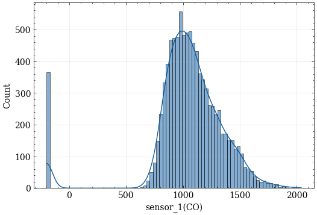

# 💼 Determination of Air Quality Using Gaussian Process Regression and Other Machine Learning Models
> *"Using Gaussian Process Regression and other Machine Learning models to predict the quality of air by determining benzene concentrations."*

---

## 📌 Table of Contents
- [Overview](#overview)
- [Business Objective](#business-objective)
- [Dataset](#dataset)
- [Tools & Techniques](#tools--techniques)
- [Exploratory Data Analysis](#exploratory-data-analysis)
- [Feature Engineering](#feature-engineering)
- [Modeling](#modeling)
- [Results & Insights](#results--insights)
- [Dashboard / Visuals](#dashboard--visuals)
- [Conclusion](#conclusion)
- [Next Steps](#next-steps)
- [Author](#author)

---

## 🧩 Overview

This project investigates the use of Gaussian Process Regression (GPR) and other machine learning models to predict air quality—specifically benzene concentration—in an Italian city. Due to the high costs of air sensors, predictive modeling offers a scalable, cost-effective alternative. GPR stands out by not only improving prediction accuracy but also providing a confidence level in each prediction, which is crucial for data-driven environmental health strategies.

Our approach involves four machine learning models: Linear Regression, Support Vector Machines, Random Forest Regressor, and Gaussian Process Regressor. The primary focus is on GPR, configured with a composite kernel of Radial Basis Function Kernel and White Kernel, which models prediction uncertainty.

Our selected baseline model, linear regression, achieved an RMSE of 3.13 and an R² score of 0.788. All our models exceeded these metrics, with GPR performing best with an RMSE of 2.33 and an R² score of 0.883.

---

## 🎯 Business Objective

To help public health officials and environmental agencies make data-driven decisions by forecasting air pollutant levels and providing uncertainty bounds to guide sensor placements and health alerts.

---

## 📊 Dataset

- **Source**: [UCI Machine Learning Repository](https://archive.ics.uci.edu/dataset/360/air+quality )
- **Size**: 9357 rows × 15 columns

- **Key Variables**: NO2, CO, NOx, O3, temperature, humidity

---

## 🛠️ Tools & Techniques

| **Category** | **Tools** |
|--------------|-----------|
| Language | Python |
| Data | `pandas`, `numpy` |
| Modeling | `scikit-learn`, |
| Visualization | `matplotlib`, `seaborn` |

---

## 🔎 Exploratory Data Analysis

Our initial exploratory analysis revealed a skewed distribution across all measurements, primarily due to the replacement of missing values with -200 by the dataset's creators. The first figure illustrates this issue using readings from Sensor 1. However, after removing the placeholder values (-200), the distribution was 'corrected', as shown in the second figure.

Further analysis revealed that the lowest benzene concentrations typically occur between 3:00 a.m. and 5:00 a.m., while the highest levels are recorded between 7:00 a.m. and 9:00 a.m. The daily and monthly distributions are presented below. Results indicate that Tuesdays and Fridays have the highest benzene concentrations. August, a prominent vacation month that includes public holidays such as Ferragosto and the Assumption of Mary, recorded relatively low pollution levels—likely due to reduced human activity. In contrast, the monthly distribution shows that September experienced the highest pollution levels.

Key steps:
- Investigated pollutant trends over time
- Identified missing values and outliers
- Analyzed correlation between weather and pollutant levels

Visuals:
- Line plot of PM2.5 over time
- Heatmap of feature correlations

---

## 🏗️ Feature Engineering

- Normalized continuous variables
- Removed highly correlated features to reduce noise
- Extracted time related features such as day, week, and month to capture seasonal patterns 

---

## 🤖 Modeling

- Models used: Linear Regression, Support Vector Machines, Random Forest, Gaussian Process Regression
- GPR provided probabilistic predictions (mean and standard deviation)
- Metrics: RMSE, R²

| **Model** | **RMSE** | **R²** |
|-----------|----------|--------|
| Linear Regression | 3.13 | 0.788 |
| Support Vector Machine | 2.35 | 0.881 |
| Random Forest | 2.34 | 0.882 |
| Gaussian Process Regression | 2.33 | 0.883 |

---

## 📈 Results & Insights

- All models outperformed the baseline
- GPR was the most accurate and provided uncertainty estimates
- These estimates help identify low-confidence predictions, guiding where new sensors should be placed or alerts issued

---

## 📊 Dashboard / Visuals

---

## 🧾 Conclusion

- GPR produced interpretable, probabilistic predictions valuable for public health monitoring
- All alternative models performed well, but lacked built-in uncertainty quantification
- Forecasting accuracy improved with GPR

---

## 👨‍💻 Author

**Olabanji Olaniyan**  
Data Scientist  
📫 [LinkedIn](https://www.linkedin.com/in/olabanji-olaniyan-59a6b0198/) | [Portfolio](https://banjiola.github.io/Olabanji-Olaniyan/)
